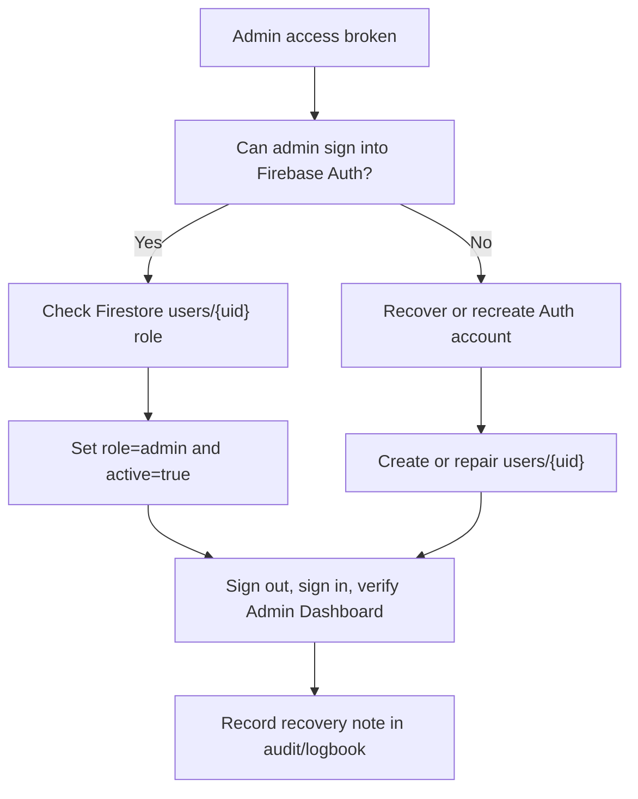

# Admin Recovery Process

Use this runbook if admin access breaks, an admin cannot sign in, the admin page
is inaccessible, or the wrong user role prevents system management.

The goal is to recover admin access without damaging production data.

## Recovery Map



## Golden Rules

- Confirm you are in the correct Firebase project before changing anything.
- Production recovery must happen only in `laundryapp-production`.
- Staging recovery must happen only in `laundryapp-staging`.
- Do not seed demo data into production.
- Do not delete Auth users during recovery unless there is a confirmed security incident.
- Keep at least two admin users active so one broken account does not lock out the business.

## What Admin Access Depends On

Admin access requires two things:

1. A Firebase Authentication user exists.
2. A matching Firestore document exists at:

```text
users/{uid}
```

That document must include:

```json
{
  "role": "admin",
  "active": true,
  "email": "admin@example.com",
  "displayName": "Admin Name"
}
```

If Auth exists but Firestore role is wrong, the user may sign in but not reach
admin pages.

If Auth does not exist or password access is broken, fix the Auth account first.

## Before You Start

Collect:

- Environment: staging or production.
- Admin email address.
- Firebase project id.
- Who approved the recovery.
- What broke: cannot sign in, cannot access admin page, wrong role, disabled user, deleted user.

Production project:

```text
laundryapp-production
```

Staging project:

```text
laundryapp-staging
```

You can print the correct Firebase Console links without changing data:

```powershell
npm run admin-recovery:production:plan
```

For staging:

```powershell
npm run admin-recovery:staging:plan
```

The helper is read-only. It does not create Auth users or modify Firestore.

## Case 1: Admin Can Sign In But Cannot Access Admin Pages

Most likely cause:

- `users/{uid}.role` is not `admin`.
- `users/{uid}.active` is not `true`.
- Firestore user document is missing.

Steps:

1. Open Firebase Console.
2. Select the correct project.
3. Go to Authentication.
4. Search for the admin email.
5. Copy the user's UID.
6. Go to Firestore.
7. Open:

```text
users/{uid}
```

8. If the document does not exist, create it.
9. Set or confirm:

```json
{
  "role": "admin",
  "active": true
}
```

10. Confirm the document includes the email and display name fields used by the app.
11. Ask the admin to sign out and sign back in.
12. Open Admin Dashboard.
13. Open User Management.
14. Open Audit Logs.

Pass criteria:

- Admin dashboard opens.
- User Management opens.
- Audit Logs open.
- Owner dashboard is not incorrectly shown unless demo role-switching is explicitly active.

## Case 2: Admin Password Does Not Work

Most likely cause:

- Forgotten password.
- Auth account exists but password is unknown.
- Email/password provider issue.

Steps:

1. Open Firebase Console.
2. Select the correct project.
3. Go to Authentication.
4. Search for the admin email.
5. If the user exists, send a password reset email.
6. Confirm the admin completes reset.
7. Confirm `users/{uid}` still has:

```json
{
  "role": "admin",
  "active": true
}
```

8. Sign in again.

Pass criteria:

- Admin can sign in with the new password.
- Admin routes work.

## Case 3: Admin Auth User Is Missing

Most likely cause:

- User was never created in this environment.
- Wrong Firebase project is being used.
- Auth user was deleted accidentally.

Steps:

1. Confirm project id is correct.
2. Open Firebase Console.
3. Go to Authentication.
4. Create a new user with the admin email.
5. Send a password reset email or set a temporary password according to Firebase Console options.
6. Copy the new UID.
7. Go to Firestore.
8. Create:

```text
users/{newUid}
```

9. Use:

```json
{
  "email": "admin@example.com",
  "displayName": "Admin Name",
  "phone": "",
  "role": "admin",
  "active": true
}
```

10. Sign in as the admin.
11. Verify Admin Dashboard and User Management.

Important:

- If the old UID had audit logs, those old logs will still point to the old UID.
- Do not overwrite unrelated user documents.
- Record that an admin UID changed.

## Case 4: All Admins Are Locked Out

Use Firebase Console directly.

Steps:

1. Confirm at least one trusted technical owner has Firebase Console access.
2. Create or recover one Auth user.
3. Create or repair that user's Firestore `users/{uid}` document.
4. Set `role` to `admin`.
5. Set `active` to `true`.
6. Sign into the app.
7. Use Admin > User Management to repair other admin/owner accounts.

After recovery:

- Create a second admin account.
- Confirm both admins can sign in.
- Review audit logs for unexpected access changes.
- Review Firebase Auth users for suspicious accounts.

## Case 5: Suspicious Admin Access Or Compromise

If you suspect a real security incident:

1. Do not delete evidence.
2. Disable suspicious user accounts in Firebase Authentication.
3. Set suspicious Firestore user documents to:

```json
{
  "active": false
}
```

4. Review Audit Logs.
5. Review Firebase Auth sign-in activity if available.
6. Review Cloud Functions logs.
7. Rotate passwords for affected admins.
8. Confirm only trusted admins remain active.
9. Export/backup current Firestore data before large corrective changes.
10. Document the incident.

## Verification Checklist

After any admin recovery:

- Admin can sign in.
- Admin Dashboard opens.
- User Management opens.
- Permission Settings opens.
- Audit Logs open.
- Demo Control Center opens for admin only.
- Owner cannot see Demo Control Center.
- Customer cannot open admin pages.
- Driver cannot open admin pages.
- At least two admin accounts exist.
- Audit/logbook note records who recovered access and why.

## Recovery Log Template

Record this outside the app if the app is unavailable:

| Field | Value |
| --- | --- |
| Date/time | |
| Environment | staging / production |
| Firebase project | |
| Admin email | |
| UID before | |
| UID after, if changed | |
| Problem | |
| Action taken | |
| Approved by | |
| Verified by | |
| Follow-up needed | |

## Prevention

- Keep two active admin users.
- Review admin users weekly during pilot.
- Do not share admin credentials.
- Use strong unique passwords.
- Use password reset instead of sharing temporary passwords when possible.
- Remove inactive staff access quickly.
- Keep backup/export and monitoring runbooks current.

## Related Runbooks

- `docs/BACKUP_EXPORT_PLAN.md`
- `docs/MONITORING_LOG_REVIEW.md`
- `docs/REGRESSION_TEST_CHECKLIST.md`
