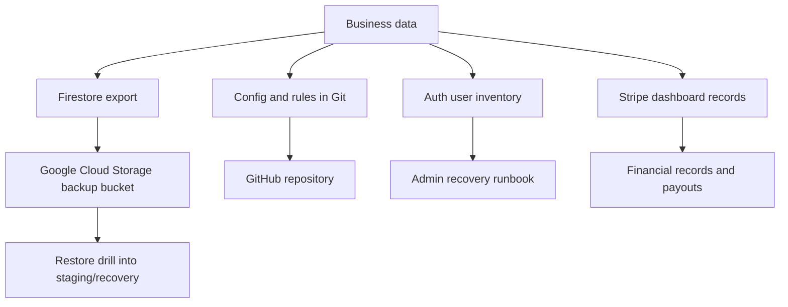

# Backup And Export Plan

This plan protects real laundromat business data once the app is used by real
customers, owners, drivers, and admins.

## Backup Goals



The backup plan should answer four questions:

- What data do we protect?
- Where is the backup stored?
- How often do we back it up?
- How do we prove restore works?

## Data To Protect

Firestore collections:

- `users`
- `customerProfiles`
- `addresses`
- `orders`
- `orderEvents`
- `batches`
- `driverProfiles`
- `recurringOrders`
- `loyaltyRewards`
- `loyaltyRewardEvents`
- `auditLogs`
- `settings`
- `services`
- `addOns`
- `comforterSizeAddOns`
- `dryCleaningItems`
- `pickupWindows`
- `payments`

Firebase/Auth records:

- User email list.
- User UID list.
- Role mapping in `users/{uid}`.
- Active/inactive status.
- Passwords are not exported. Firebase manages password secrets.

Configuration stored in GitHub:

- Firestore rules.
- Firestore indexes.
- Cloud Functions source.
- Mobile app source.
- EAS config.
- Deployment scripts.
- Backup helper scripts.

External systems:

- Stripe payments and payouts.
- App Store / Play Store credentials.
- Expo/EAS build history.

## Environment Separation

Backups must stay separated by environment.

| Environment | Purpose | Backup bucket pattern |
| --- | --- | --- |
| Staging | Real QA/testing data | `gs://laundryapp-staging-firestore-backups` |
| Production | Real business data | `gs://laundryapp-production-firestore-backups` |

Never restore staging data into production.

Never seed demo data into production.

Never run destructive cleanup against production backup buckets.

## Recommended Schedule

Before pilot launch:

- Export staging before major QA passes.
- Export production before first real customer.
- Perform one restore drill into staging or a separate recovery Firebase project.

During pilot:

- Daily Firestore export.
- Manual export before every production deploy.
- Keep at least 30 days of backups.
- Review backup status weekly.

After full launch:

- Daily backups minimum.
- Consider 90-day retention for audit/accounting support.
- Keep monthly snapshots for long-term business records.

## Recovery Targets

Recommended business targets:

| Target | Meaning | Starting goal |
| --- | --- | --- |
| RPO | Maximum data you can afford to lose | 24 hours during pilot |
| RTO | Maximum time to recover service | 4-8 hours during pilot |

As order volume grows, tighten these targets.

## Google Cloud Setup Tasks

One-time owner/admin setup:

1. Open Google Cloud Console for `laundryapp-staging`.
2. Create a Cloud Storage bucket:

```text
laundryapp-staging-firestore-backups
```

3. Open Google Cloud Console for `laundryapp-production`.
4. Create a Cloud Storage bucket:

```text
laundryapp-production-firestore-backups
```

5. Use the same region/location strategy as Firestore when possible.
6. Limit bucket access to trusted project admins.
7. Turn on bucket retention/lifecycle rules if available.
8. Document who can create, read, and restore backups.

## Manual Export Commands

Preview the staging export command without running it:

```powershell
npm run backup:staging:plan
```

Run a staging export:

```powershell
npm run backup:staging:run
```

Preview the production export command without running it:

```powershell
npm run backup:production:plan
```

Run a production export:

```powershell
npm run backup:production:run
```

The helper script lives at:

```text
scripts/firestore-backup-export.ps1
```

By default the helper prints the export command only. It executes the export
only when `-RunExport` is supplied. Production execution also requires
`-AllowProduction`.

## Custom Bucket Or Prefix

Use a custom bucket:

```powershell
powershell -ExecutionPolicy Bypass -File .\scripts\firestore-backup-export.ps1 -Environment production -Bucket "my-production-backup-bucket"
```

Use a custom backup folder/prefix:

```powershell
powershell -ExecutionPolicy Bypass -File .\scripts\firestore-backup-export.ps1 -Environment production -Prefix "before-payment-launch-2026-06-27"
```

Run that custom export:

```powershell
powershell -ExecutionPolicy Bypass -File .\scripts\firestore-backup-export.ps1 -Environment production -Bucket "my-production-backup-bucket" -Prefix "before-payment-launch-2026-06-27" -RunExport -AllowProduction
```

## Restore Drill

Do not wait for an emergency to learn restore.

Restore drill process:

1. Pick a recent staging export.
2. Create or choose a recovery/staging Firebase project.
3. Import the backup into that non-production project.
4. Point a staging app build at the recovery project.
5. Confirm:
   - Users collection exists.
   - Orders load.
   - Order details load.
   - Owner can view business configuration.
   - Driver routes load.
   - Audit logs load.
6. Record the restore date, source backup, target project, result, and issues.

Never practice restore directly into production.

## Auth Recovery Notes

Firestore export protects role/profile documents, but Firebase Auth password
credentials are managed separately by Firebase.

Protect access by:

- Keeping at least two admin users.
- Recording emergency admin recovery steps.
- Using Firebase Console to recover locked admin access.
- Keeping role documents in Firestore backed up.

If Auth users are lost or migrated:

- Recreate users in Firebase Auth.
- Match each recreated user to the right role/profile document.
- Send password reset emails.
- Verify owner/admin access before reopening the business workflow.

## Stripe And Financial Data

Firestore may store order payment status and Stripe PaymentIntent ids, but Stripe
remains the source of truth for real payments, payouts, refunds, and disputes.

Before real payments:

- Verify Stripe account access.
- Document who can view payouts/refunds.
- Export Stripe reports monthly.
- Reconcile paid orders against Stripe payout records.

## Backup Verification Checklist

Run weekly during pilot:

- Confirm latest staging backup exists.
- Confirm latest production backup exists.
- Confirm backup bucket is not public.
- Confirm backup naming includes date/time.
- Confirm backup completed after last production deploy.
- Confirm at least one restore drill has been completed.
- Confirm two admin users can access Firebase Console.

## Before Every Production Deploy

Required:

1. Run regression tests.
2. Confirm staging QA passes.
3. Run:

```powershell
npm run backup:production:plan
```

4. Run production export:

```powershell
npm run backup:production:run
```

5. Confirm the export appears in the production backup bucket.
6. Write down the backup path in the release notes.
7. Deploy production.
8. Smoke test production.

## Incident Response

If data is accidentally changed or deleted:

1. Stop making more production changes.
2. Identify affected collections/documents.
3. Check audit logs for actor/action/time.
4. Find the most recent clean backup.
5. Restore into a separate recovery project first.
6. Compare recovered data with production.
7. Decide whether to:
   - Manually repair a small number of documents.
   - Run a controlled import into production.
   - Roll forward from audit/history records.
8. Record the incident and prevention steps.

## Ownership

Business owner:

- Confirms backup schedule meets business needs.
- Confirms who has Firebase/GCP access.
- Confirms restore drills are performed.

Technical admin:

- Runs export commands.
- Reviews backup success.
- Maintains scripts and documentation.
- Performs restore drills.

Operator/owner user:

- Does not run backups from the app.
- Uses audit logs and reports to spot suspicious business activity.
