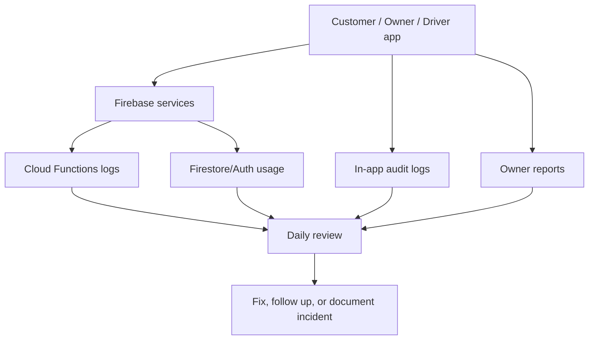

# Monitoring And Log Review

This runbook helps catch production errors early before they turn into customer
complaints, missed pickups, unpaid orders, or broken owner workflows.

## Monitoring Goals



Monitoring should answer:

- Are customers able to sign in and place orders?
- Are owners able to accept, price, batch, and complete orders?
- Are drivers able to see and submit assigned routes?
- Are payments, rewards, and audit logs behaving correctly?
- Are there permission errors, function failures, or suspicious role changes?
- Did backups complete?

## Severity Levels

| Severity | Meaning | Examples | Response |
| --- | --- | --- | --- |
| Critical | Business cannot operate | Customers cannot place orders, owner cannot log in, payment confirmation broken | Stop release, fix immediately |
| High | Core workflow partly broken | Driver routes fail, final price cannot save, batch assignment broken | Same day fix |
| Medium | Business can operate with workaround | Report chart broken, one filter wrong, noncritical notification failure | Schedule fix |
| Low | Cosmetic or minor usability issue | Text overflow, spacing, small visual polish | Backlog |

## Daily Staging Review

Use during active development and QA.

Run:

```powershell
npm run monitoring:staging:plan
```

Optionally read recent staging Cloud Functions logs:

```powershell
npm run monitoring:staging:logs
```

Check:

- Cloud Functions errors.
- Firestore permission-denied errors after normal app actions.
- Failed admin user creation.
- Failed staging seed/reset actions.
- Failed rewards awarding/redemption.
- Failed payment function calls.
- Audit logs created for owner/admin/driver actions.
- Staging orders do not get stuck in unexpected statuses.

## Daily Production Review

Use once real users or pilot users exist.

Run:

```powershell
npm run monitoring:production:plan
```

Read production logs only when intentionally reviewing live data:

```powershell
npm run monitoring:production:logs
```

Check:

- New customer account creation.
- Failed sign-ins or account lockout complaints.
- New orders created today.
- Orders stuck in `requested`, `accepted`, `in_progress`, or `ready_for_delivery`.
- Payment status mismatches.
- Driver route submissions.
- Audit log entries for owner/admin actions.
- Unexpected role or active/inactive user changes.
- Cloud Functions errors/timeouts.
- Firestore usage and billing.
- Backup completion status.

## In-App Audit Log Review

Admin should review Audit Logs for:

- `order.status_changed`
- `order.price_saved`
- `order.payment_finalized`
- `batch.created`
- `batch.route_submitted`
- `order.driver_stop_updated`
- `user.created`
- `user.access_updated`
- `configuration.saved`
- `rewards.adjusted`
- `rewards.redeemed`
- `staging.seed_users`
- `staging.seed_orders`
- `staging.reset_demo_data`

Watch for:

- Owner actions outside business hours.
- Repeated price changes.
- Payment finalized then corrected manually.
- User roles changed unexpectedly.
- Driver route submitted with missing stops.
- Staging/demo actions appearing in production.

## Owner Operations Dashboard Review

Owner should check:

- New request count.
- Price/payment count.
- Pickup-ready count.
- Delivery-ready count.
- Submitted driver routes.
- Orders that have not moved in 24 hours.
- Orders with final price missing.
- Orders marked paid but not ready for delivery.
- Orders ready for delivery but not assigned to a driver.

Suggested daily rhythm:

1. Morning: check new requests and pickup-ready orders.
2. Midday: check in-progress and price/payment orders.
3. Afternoon: check delivery-ready orders and driver route submissions.
4. End of day: check stuck orders and audit logs.

## Firebase Console Review

Use the helper command to print project-specific console links:

```powershell
npm run monitoring:production:plan
```

Review these areas:

- Firebase Overview: service health.
- Authentication: unusual sign-in failures or disabled users.
- Firestore Usage: read/write spikes, storage growth.
- Firestore Rules: confirm latest rules deployed.
- Cloud Functions: errors, timeouts, invocation volume.
- Cloud Logging: deeper function and platform logs.

## Cloud Functions Log Review

Look for:

- Function invocation errors.
- Permission failures.
- Stripe/payment errors when payment module is active.
- Rewards function failures.
- User creation function failures.
- Seed/reset functions running in the wrong environment.
- Slow functions or timeout warnings.

Common response:

- Read the function name.
- Read the timestamp.
- Match it to a user action or audit log event.
- Reproduce in staging if possible.
- Fix and redeploy staging first.
- Deploy production only after staging passes.

## Alert Thresholds

Create alerts later for:

- Any Cloud Function error in production.
- Repeated failed sign-ins.
- Spike in Firestore permission-denied logs.
- Firestore read/write usage above normal.
- Cloud Functions timeout.
- Payment confirmation failure.
- Backup job failure.
- No orders created during expected business hours if marketing/order volume says there should be activity.

## Weekly Business Review

Review every week during pilot:

- Total orders.
- Total revenue.
- Average order value.
- Repeat customers.
- Most popular pickup windows.
- Driver completed routes.
- Failed pickups/deliveries.
- Refunds/payment issues.
- Rewards adjustments.
- Admin/owner audit activity.
- Backup status.

Use this to spot business process problems, not only software defects.

## Incident Response

If something looks wrong:

1. Write down the date/time.
2. Identify affected role: customer, owner, driver, admin.
3. Identify affected order/user/batch id.
4. Check app Audit Logs.
5. Check Cloud Functions logs.
6. Check Firestore document state.
7. Reproduce in staging if possible.
8. Decide severity.
9. Fix in staging first unless production is fully blocked.
10. Record what happened and how it was resolved.

## Monitoring Before Production Deploy

Before each production deploy:

- Run regression tests.
- Run staging QA.
- Run `npm run backup:production:plan`.
- Confirm backup destination.
- Run production backup if live data exists.
- Run `npm run monitoring:production:plan`.
- Confirm production Firebase project is correct.
- Confirm no unresolved critical/high errors in staging logs.

After production deploy:

- Smoke test production login.
- Confirm customer order creation if safe with test account.
- Confirm owner dashboard loads.
- Check Cloud Functions logs.
- Check Audit Logs.
- Watch for errors for at least 30 minutes after deploy.

## Monitoring Ownership

Business owner:

- Reviews operational dashboard.
- Reviews stuck orders.
- Confirms customer/driver issues are followed up.

Technical admin:

- Reviews Firebase logs.
- Reviews function errors.
- Reviews backup status.
- Documents incidents.

Admin user:

- Reviews audit logs.
- Reviews user access changes.
- Confirms demo/staging tools are not used in production.
