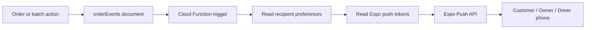

# Phase 4: Notifications Module

Last updated: 06/27/2026

## Goal

Add the notification foundation for the laundromat workflow:

- Customer order status notifications.
- Owner new request notifications.
- Driver assigned route notifications.
- Notification preferences.
- Native push notification testing plan.

## What Is Implemented

| Area | Status | Notes |
|---|---|---|
| Customer order status notifications | Implemented in backend trigger | Order events send customer-facing updates when the order status changes, final price is set, or driver route status updates affect the customer's order. |
| Owner new request notifications | Implemented in backend trigger | New customer order requests notify active owner users with push tokens. |
| Owner payment notifications | Implemented in backend trigger | Payment-completed order events notify active owner users when enabled. |
| Driver assigned route notifications | Implemented in backend trigger | Batch assignment events notify the assigned driver. |
| Notification preferences | Implemented | Users can save role-relevant notification preferences from the account panel. |
| Firestore rules | Implemented and tested | Users can update their own `notificationPreferences` and `expoPushTokens`, but cannot change role/status. |
| Native push testing | Blocked until EAS linking/build | Real remote push cannot be proven in web preview. |

## How Notifications Flow



## Preference Keys

Each user has this object on `users/{uid}`:

```json
{
  "notificationPreferences": {
    "customerOrderUpdates": true,
    "ownerNewRequests": true,
    "ownerPaymentUpdates": true,
    "driverAssignedRoutes": true,
    "rewardsUpdates": true
  }
}
```

Role-specific UI:

- Customer sees order status updates and rewards updates.
- Owner sees new order requests and payment updates.
- Driver sees assigned route updates.
- Admin sees operational notification controls.

## Backend Routing

| Event | Recipient | Preference |
|---|---|---|
| `order_created` | Active owners | `ownerNewRequests` |
| `payment_completed` | Active owners | `ownerPaymentUpdates` |
| `batch_assigned` | Assigned driver | `driverAssignedRoutes` |
| Other order status events | Customer who owns the order | `customerOrderUpdates` |

Inactive users, users without push tokens, and users with the related preference disabled are skipped.

## Native Testing Requirements

Push notifications require:

- EAS project id in `apps/mobile/app.json`.
- User logged in to EAS.
- Android/iOS native build.
- Device notification permission granted.
- Expo push token saved on `users/{uid}.expoPushTokens`.
- Staging Cloud Functions deployed.

Web preview can test preference saving, but it cannot prove real push delivery.

## Android Staging Push Test

After Phase 3 EAS setup is complete:

```powershell
npm run mobile:readiness:staging
npm run mobile:build:android:staging
npm run deploy:staging:functions
```

On a real Android phone:

1. Install the staging APK.
2. Sign in as customer and tap `Enable` under Notifications.
3. Confirm Android asks for notification permission.
4. Confirm the user doc has an Expo token in `expoPushTokens`.
5. Sign in as owner on another device/session.
6. Move that customer's order through statuses.
7. Confirm the customer receives order status notifications.
8. Sign in as owner and enable notifications.
9. Create a new customer order.
10. Confirm owner receives a new request notification.
11. Sign in as driver and enable notifications.
12. Assign a batch to that driver.
13. Confirm driver receives assigned route notification.

## Preference Test

For each role:

1. Enable notifications.
2. Turn off the relevant preference.
3. Trigger that event.
4. Confirm no push is received.
5. Turn the preference back on.
6. Trigger the event again.
7. Confirm push is received.

## Validation Run

Commands run:

```powershell
npm run check:functions
npm run test:emulator
cd apps/mobile
$env:NODE_OPTIONS='--use-system-ca'; npx expo export --platform web --output-dir dist-check
```

Results:

- Functions build passed.
- Firestore rules emulator regression passed.
- Expo web export passed.

## Remaining Work

- Link EAS project id.
- Build Android staging APK.
- Deploy latest Cloud Functions to staging.
- Test push token registration on a real phone.
- Test end-to-end customer, owner, and driver push delivery.
- Add an in-app notification inbox later if the business wants a history of alerts inside the app.
