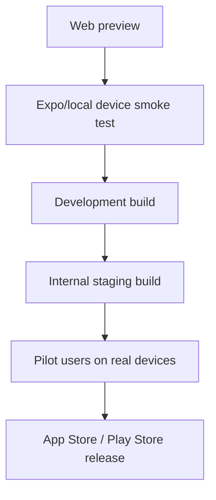

# Real Mobile Device Testing

Web preview is useful for fast development, but it is not enough for production
mobile readiness. This checklist proves the app works on real phones with real
touch input, native navigation, device storage, network conditions, push
notifications, and payment SDK behavior.

## Mobile Testing Ladder



## Current Project Status

Already in place:

- Expo React Native app.
- Expo Router navigation.
- EAS build profiles in `apps/mobile/eas.json`.
- Android package id: `com.laundryapp.mobile`.
- iOS bundle id: `com.laundryapp.mobile`.
- Stripe React Native SDK installed.
- Expo Notifications installed.
- Firebase staging/production environment examples.

Still needed before serious real-device QA:

- Replace `REPLACE_WITH_EAS_PROJECT_ID` in `apps/mobile/app.json`.
- Confirm `.env.staging` contains real staging Firebase values.
- Confirm `.env.production` contains production Firebase values before release.
- Create internal Android build.
- Create internal iOS build when Apple credentials are ready.
- Test push notifications in a development or release build, not only web.
- Test Stripe only during the payment module.

## 1. Local Device Smoke Test

Goal: quickly check touch layout and navigation on a phone during development.

Use this for:

- Layout checks.
- Touch target checks.
- Form entry checks.
- Navigation checks.
- Basic sign-in and order creation.

Tasks:

- Connect phone and computer to the same trusted network.
- Start Expo from `apps/mobile`.
- Open the app on the phone.
- Sign in as customer, owner, driver, and admin test users.
- Check screens in portrait orientation.
- Check scroll behavior on long pages like New Order and Configuration.

Pass criteria:

- Text is readable.
- Buttons are easy to tap.
- No content is hidden behind sticky panels.
- Keyboard does not block important form fields.
- Back navigation behaves naturally.
- Role redirects still work.

Known limitation:

- Expo Go/local preview may not behave exactly like the final production app,
  especially for push notifications, Stripe native flows, and native build
  configuration.

## 2. Android Internal Staging Build

Goal: install a real Android APK on a physical device and test staging data.

Use this before:

- Owner/business demos.
- Driver route workflow demos.
- Any pilot test with a real laundromat.

Expected command from repo root:

```powershell
cd apps/mobile
npx eas build --profile preview --platform android
```

What this should produce:

- An internal Android build.
- A downloadable APK or install link from Expo/EAS.
- The app using `EXPO_PUBLIC_APP_ENV=staging`.

Pass criteria:

- App installs on Android.
- Staging banner appears.
- Firebase project is staging.
- Customer can create an order.
- Owner can accept, price, and finalize payment status.
- Driver can open assigned route and submit it.
- Admin can view user management, audit logs, and demo control center.

## 3. iPhone Internal Staging Build

Goal: test the real iOS app on physical iPhone hardware.

Expected command from repo root:

```powershell
cd apps/mobile
npx eas build --profile preview --platform ios
```

Requirements:

- Apple Developer account.
- Correct iOS bundle identifier.
- Device registration or TestFlight-style distribution.
- EAS project configured.

Pass criteria:

- App installs on iPhone.
- Login and role routing work.
- New Order page feels good with iOS keyboard.
- Date/time controls are tappable.
- Sticky estimated cost panel does not block content.
- Owner order detail and configuration pages scroll correctly.
- Driver route buttons are easy to use in the field.

## 4. Native Feature Testing

These features must be tested on real builds, not only web.

Push notifications:

- Enable notifications from the app.
- Confirm the device asks for notification permission.
- Confirm token is saved under `users/{uid}.expoPushTokens`.
- Trigger a test order/status event.
- Confirm notification appears.
- Tap notification and confirm it opens the intended route.

Payments:

- Save Stripe testing for the payment module.
- Confirm Stripe publishable key is in mobile env only.
- Confirm Stripe secret key is in Cloud Functions only.
- Use Stripe test cards only.
- Confirm payment status is backend-controlled.

Deep links:

- Confirm `laundryapp://` scheme opens the app.
- Confirm order tracking links route correctly when the app is already open.
- Confirm order tracking links route correctly from a cold app start.

Offline/poor network:

- Turn on airplane mode after login.
- Open active order detail.
- Confirm the app fails gracefully.
- Turn network back on.
- Confirm refresh works.

Device permissions:

- Notifications can be allowed.
- Notifications can be denied without breaking the app.
- No unnecessary camera, microphone, location, or contacts prompts appear.

## 5. Customer Real-Device QA

Tasks:

- Sign in.
- Create new order.
- Enter phone keyboard values for weight, ZIP, gratuity, and final review.
- Add add-ons.
- Add notes.
- Save address for future orders.
- Submit order.
- Open order history.
- Open tracking page.
- Open rewards.
- Open payment method page.
- Create recurring order only when profile address exists.

Pass criteria:

- Keyboard types match field type.
- Form validation is clear.
- Long forms scroll comfortably.
- Estimated cost remains useful without blocking content.
- Customer cannot open owner/admin/driver pages.

## 6. Owner Real-Device QA

Tasks:

- Open dashboard.
- Use attention tiles.
- Filter/sort orders.
- Open analytics report.
- Accept/decline orders with confirmations.
- Move order to in progress.
- Save final price.
- Finalize payment status.
- Create pickup batch.
- Create delivery batch.
- Open business configuration.
- Save configuration and confirm the change summary.
- Open reports.
- Open recurring orders.
- Open rewards page and toggle rewards.

Pass criteria:

- Dense grids remain readable.
- Filters are tappable.
- Modals fit on phone.
- Confirmation steps are obvious.
- No owner-only action appears for customer or driver.

## 7. Driver Real-Device QA

Tasks:

- Sign in as driver.
- Open assigned route.
- Confirm customer address is visible.
- Mark stop picked up or delivered.
- Unselect a stop.
- Finalize and submit route.
- Reopen completed route.

Pass criteria:

- Stop buttons are thumb-friendly.
- Submitted route no longer shows an active finalize action.
- Driver cannot see unrelated batches or owner screens.
- Route status persists after app restart.

## 8. Admin Real-Device QA

Tasks:

- Sign in as admin.
- Open User Management.
- Search users.
- Create test user if needed.
- Send password reset.
- Open Permissions.
- Open Audit Logs.
- Open Demo Control Center.
- Seed/reset staging data only in staging.

Pass criteria:

- Admin pages are usable on phone, even if they are operationally denser.
- Admin-only links never appear for owner.
- Staging/demo controls clearly warn what environment is active.

## 9. Pilot Readiness Gate

Before a real laundromat pilot:

- Android staging build tested on at least one real Android phone.
- iPhone staging build tested on at least one real iPhone.
- Customer, owner, driver, and admin flows tested on physical devices.
- Firestore rules regression passes.
- Cloud Functions deploy to staging passes.
- Push notification smoke test passes.
- Payment module either disabled or clearly marked as demo until Stripe is ready.
- Support contact information is visible.
- Privacy policy and terms drafts are ready for review.

## 10. Device Test Log Template

Use one row per device:

| Date | Device | OS | Build profile | Role tested | Result | Notes |
| --- | --- | --- | --- | --- | --- | --- |
| 06/27/2026 | Pixel / Galaxy / iPhone | Android/iOS version | preview | customer | Pass/Fail | Notes |

Track every issue with:

- Device and OS.
- Role.
- Page.
- Steps to reproduce.
- Expected result.
- Actual result.
- Screenshot or short screen recording when possible.
