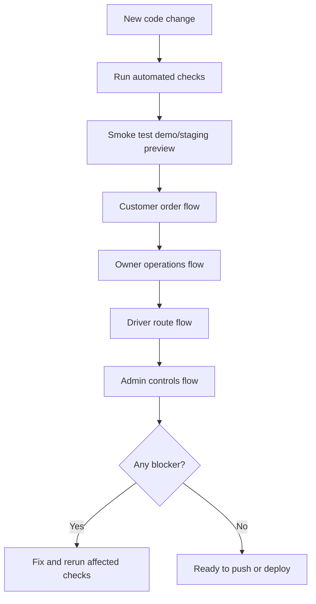

# Regression Test Checklist

Use this checklist before merging, pushing a large feature, deploying to staging,
or showing the app in a serious demo. The goal is simple: prove new changes did
not break the core laundromat workflow.

## Quick Regression Flow



## 1. Automated Gate

Run from the repo root:

```powershell
npm run test:regression
```

This command runs:

- Cloud Functions TypeScript build.
- Firestore emulator role/rules tests.

Pass criteria:

- Cloud Functions build without TypeScript errors.
- Firestore rules tests pass.
- No command exits with an error.

If the emulator says Java is missing, use Java 21 or newer.

For heavier UI route-refresh testing, run `npm run test:routes:refresh` only
when you specifically need to verify direct URL refresh behavior. That script
exports the web app and starts a temporary local preview server, so it is kept
out of the default regression command.

## 2. Environment Smoke Check

Run this before staging testing:

```powershell
npm run env:staging:check
npm run preview:staging
```

Open the local preview shown in the terminal.

Pass criteria:

- The app loads.
- The environment banner says staging.
- The Firebase project is `laundryapp-staging`.
- Sign-in page accepts typing into email and password.
- Sign-in button enables when valid credentials are entered.

Fail if:

- The app silently runs in demo mode during staging QA.
- The Firebase project is missing or wrong.
- Direct route refresh shows a blank page.

## 3. Customer Core Workflow

Sign in as a customer.

Tasks:

- Open Customer Home.
- Open Profile Summary.
- Confirm name, email, phone, and default address load.
- Start a new order.
- Enter estimated pounds.
- Select wash and fold.
- Add at least one add-on.
- Enter customer address.
- Use "Save address for future orders" when appropriate.
- Select pickup and drop-off windows.
- Add fresh order notes.
- Select gratuity.
- Review the estimated cost.
- Go to order review.
- Authorize demo payment.
- Place order request.
- Open order detail.
- Open tracking page.

Pass criteria:

- The order submits successfully.
- The order number appears.
- Address, notes, add-ons, gratuity, and estimate carry into review/detail.
- Customer timeline starts at requested.
- Customer cannot access owner, driver, or admin routes.

## 4. Owner Order Workflow

Sign in as owner.

Tasks:

- Open Owner Dashboard.
- Confirm attention tiles show counts.
- Click New Requests and confirm orders page is filtered correctly.
- Open a requested order.
- Accept the order using the confirmation step.
- Move order to in progress.
- Try saving blank or zero final price and confirm warning appears.
- Save a real final price.
- Confirm saved price notification appears.
- Review final payment.
- Confirm final payment.
- Confirm final price is locked after payment finalization.
- Mark ready for delivery when appropriate.

Pass criteria:

- Status changes persist after refresh.
- Final price persists after refresh.
- Paid orders lock final price edits.
- Declined orders cannot be priced.
- Owner sees customer email, phone, and address on manage order page.
- Owner cannot access admin-only pages such as Demo Control Center or User
  Management.

## 5. Owner Batch Workflow

Sign in as owner.

Tasks:

- Open Batch Management.
- Choose pickup batch type.
- Confirm accepted orders appear under eligible orders.
- Select one or more eligible orders.
- Assign a driver.
- Enter a batch date.
- Create and assign batch.
- Confirm the batch appears in recent/assigned batches.
- Expand included orders.
- Confirm customer address appears for each order.

Pass criteria:

- Batch creation succeeds.
- Selected orders appear in the created batch.
- Assigned driver can see the batch.
- Pickup + delivery mode can select orders individually.

## 6. Driver Route Workflow

Sign in as driver.

Tasks:

- Open Driver Home.
- Open assigned batch/route.
- Confirm customer address is visible.
- Mark pickup or delivery stop.
- Confirm check mark appears.
- Confirm button changes to unselect when checked.
- Finalize and submit route.
- Reopen completed route.

Pass criteria:

- Driver sees only assigned routes.
- Driver cannot access owner/admin pages.
- Completed route does not keep showing an active finalize button.
- Submitted route appears for owner review.

## 7. Admin Workflow

Sign in as admin.

Tasks:

- Open Admin Dashboard.
- Open User Management.
- Search signed-up users.
- Create a customer, owner, driver, and admin test user if needed.
- Confirm new users appear in the signed-up users list.
- Send or trigger password reset where available.
- Open Permission Settings.
- Open Demo Control Center.
- Reset staging demo data.
- Seed staging users.
- Seed sample orders.
- Open Audit Logs.
- Filter audit logs by actor, role, action, date range, and resource type.

Pass criteria:

- Admin-only pages are visible to admin.
- Owner cannot see Demo Control Center.
- User creation writes Auth and Firestore records.
- Audit logs show owner/admin/driver actions.
- Staging reset/seed tools refuse production projects.

## 8. Rewards Regression

Tasks:

- Confirm owner/admin can view rewards management.
- Toggle rewards on/off from the rewards page.
- Confirm customer rewards page respects the toggle.
- Confirm customers cannot grant themselves points.
- Confirm completed paid orders can award points through backend logic when that
  path is being tested.
- Confirm rewards history/ledger displays expected events.

Pass criteria:

- Rewards are controlled by owner/admin settings.
- Customer balances cannot be edited by customers.
- Rewards audit logs exist for adjustments/redemptions.

## 9. Reports And Analytics Regression

Tasks:

- Owner opens Orders.
- Click View Analytics Report.
- Confirm report opens without breaking filters.
- Check revenue, popular pickup window, service mix, customer/order insights.
- Owner opens Reports.
- Confirm revenue, order, customer, driver, service, and repeat-customer sections
  load.

Pass criteria:

- Reports load with real or seeded data.
- Empty states explain what data is needed next.
- Analytics does not change order filters or statuses by mistake.

## 10. Cross-Role Security Spot Checks

Run these after major Auth, Firestore, routing, or role changes.

Customer should fail:

- Open `/orders`.
- Open `/batches`.
- Open `/users`.
- Open another customer's order detail if you know the URL.

Owner should fail:

- Open `/users`.
- Open `/demo-control`.
- Open `/audit-logs` if audit logs are admin-only.

Driver should fail:

- Open `/orders`.
- Open `/batches` owner page.
- Open `/users`.
- Open unrelated batch/order URL.

Unauthenticated user should fail:

- Open private customer, owner, driver, or admin routes.

Pass criteria:

- Wrong-role routes redirect away or show protected access.
- Private Firestore reads/writes are denied by emulator tests.

## 11. Production Safety Gate

Before production deploy:

- Run `npm run test:regression`.
- Run full staging workflow with real staging accounts.
- Deploy Firestore rules to staging first.
- Deploy Functions to staging first.
- Confirm staging seed/reset tools do not point to production.
- Confirm production environment variables are present.
- Confirm production app does not rely on local demo fallback.
- Confirm backup/export plan is ready.
- Run `npm run backup:production:plan` and confirm the destination is correct.
- Run `npm run monitoring:production:plan` and confirm the project links are correct.
- Run `npm run admin-recovery:production:plan` and confirm the project links are correct.
- Confirm emergency admin recovery process is documented.

Do not proceed to production if:

- Any role can see the wrong data.
- Customer can edit final price, status, rewards, or payment status.
- Driver can see unrelated customer/order data.
- Owner can access admin-only tools.
- Payment status can be changed directly by the client.

## Suggested Regression Schedule

- Small UI-only change: run automated checks plus the affected page.
- Order, payment, rewards, or role change: run full checklist.
- Firebase rules or Cloud Functions change: run automated checks plus staging QA.
- Before every staging deploy: run automated checks.
- Before every production deploy: run automated checks, full staging QA, and
  production safety gate.
