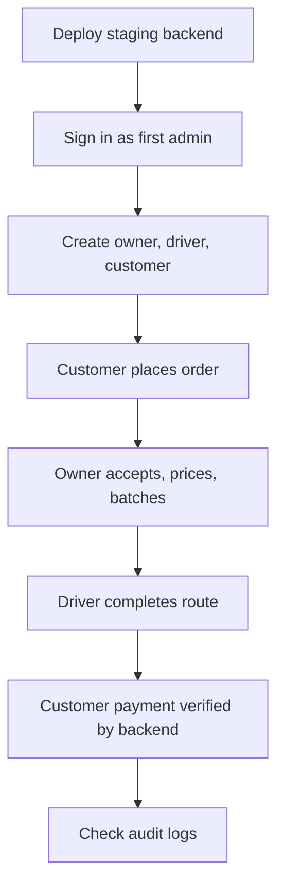

# Staging Test Plan

Use this after `npm run deploy:staging` succeeds.

For the current no-Functions staging test, run the web preview with staging
Firebase values:

```powershell
npm run env:staging:check
npm run preview:staging
```

Open:

```text
http://localhost:8100
```

If the sign-in button stays disabled after entering email and password, the app
is probably running in demo mode or missing Firebase environment values.

## Staging Flow



## 1. Admin Access

Expected result: only the admin user can open the system admin area.

Tasks:

- Sign in with the manually created admin account.
- Open Admin dashboard.
- Open User management.
- Confirm signed-up users load from Firestore.
- Confirm Demo Control Center is visible for admin.

Pass criteria:

- Admin can enter system admin pages.
- Admin can see user management.
- Admin can see demo control center, but demo reset/seed controls are disabled
  outside demo mode.

## 2. User Creation

Expected result: admin-created users exist in Firebase Auth and Firestore.

Tasks:

- Create one owner user.
- Create one driver user.
- Create one customer user.
- Send password reset for each user.
- Confirm each user appears in Firebase Authentication.
- Confirm each user appears in Firestore `users`.

Pass criteria:

- Owner has `role: "owner"`.
- Driver has `role: "driver"`.
- Customer has `role: "customer"`.
- All users have `active: true`.

## 3. Role Permissions

Expected result: each role only sees its own workspace.

Tasks:

- Sign in as customer.
- Try customer home and new order.
- Confirm owner/admin pages redirect away.
- Sign in as owner.
- Try owner orders, batches, configuration.
- Confirm system admin pages redirect away.
- Sign in as driver.
- Try driver batches.
- Confirm owner/admin pages redirect away.

Pass criteria:

- Customer cannot access owner, driver, or admin pages.
- Owner cannot access admin-only pages.
- Driver cannot access owner/admin pages.

## 4. Customer Order

Expected result: a real Firestore order is created.

Tasks:

- Sign in as customer.
- Create a new order.
- Use realistic customer address.
- Select wash and fold.
- Add any add-ons or dry-cleaning items.
- Go through order review.
- Submit the order.
- Check Firestore `orders`.

Pass criteria:

- Order document exists.
- `customerId` matches the customer user UID.
- `status` is `requested`.
- `paymentStatus` is `unpaid`.

## 5. Owner Order Operations

Expected result: owner can process the order and audit logs are written.

Tasks:

- Sign in as owner.
- Open Orders.
- Accept the customer order.
- Move it to received/in progress.
- Save final price.
- Finalize payment only when appropriate.
- Check Firestore `auditLogs`.

Pass criteria:

- Status changes persist after refresh.
- Final price persists after refresh.
- Audit logs exist for owner actions.

## 6. Batches And Driver Route

Expected result: owner assigns eligible orders and driver sees only assigned
routes.

Tasks:

- As owner, create a pickup or delivery batch.
- Assign it to the driver.
- Sign in as driver.
- Open assigned batch.
- Mark stops.
- Finalize and submit route.

Pass criteria:

- Driver sees assigned batch.
- Driver cannot see unrelated owner screens.
- Route submission persists.

## 7. Payment Backend Check

Expected result: payment status is controlled by the backend.

Tasks:

- Use Stripe test mode values.
- Customer opens payment page for a final-priced order.
- Complete Stripe PaymentSheet using test card data.
- Confirm backend marks the order paid.
- Check Firestore `orderEvents`.

Pass criteria:

- Client does not directly write paid status.
- Cloud Function verifies payment.
- Order has `paymentStatus: "paid"` only after backend confirmation.

## 8. Production Gate

Do not deploy production until every staging section passes.

Production is ready only when:

- Staging deploy succeeds.
- Auth works for all roles.
- Firestore rules block wrong-role access.
- Admin-created users work.
- Orders persist.
- Batches persist.
- Audit logs persist.
- Payment confirmation works through backend.
