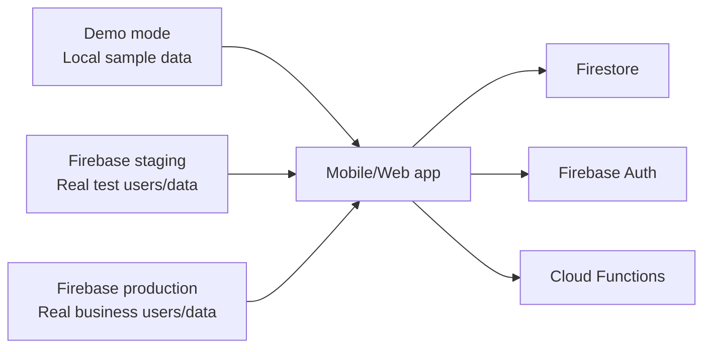

# Phase 8: Production Readiness

Goal: prepare Firebase for real users while keeping demo, staging, and production separated.

## Current Environment Model



- Demo is for local walkthroughs and sample data.
- Staging is for real Firebase testing before launch.
- Production is for real customers, staff, and business data only.

## Readiness Commands

Run staging checks:

```powershell
npm run phase8:staging:check
```

Run production checks:

```powershell
npm run phase8:production:check
```

Deploy staging rules:

```powershell
powershell -ExecutionPolicy Bypass -File .\scripts\phase8-production-readiness.ps1 -Environment staging -DeployRules
```

Deploy staging functions:

```powershell
powershell -ExecutionPolicy Bypass -File .\scripts\phase8-production-readiness.ps1 -Environment staging -DeployFunctions
```

Deploy production rules only after staging passes:

```powershell
powershell -ExecutionPolicy Bypass -File .\scripts\phase8-production-readiness.ps1 -Environment production -DeployRules -AllowProductionDeploy
```

Deploy production functions only after staging passes:

```powershell
powershell -ExecutionPolicy Bypass -File .\scripts\phase8-production-readiness.ps1 -Environment production -DeployFunctions -AllowProductionDeploy
```

## Pass Checklist

| Pass | Status | Notes |
| --- | --- | --- |
| Deploy rules to staging | Complete | `firestore.rules` compiled and deployed to `laundryapp-staging`. |
| Deploy functions to staging | Blocked by Blaze | Firebase stopped while enabling required Cloud Functions APIs because staging is not on Blaze. |
| Test staging accounts | Manual test required | Admin, owner, driver, customer. |
| Deploy rules to production | Hold until staging passes | Requires explicit production flag in helper script. |
| Deploy functions to production | Hold until staging functions pass | Also requires Blaze. |
| Remove unsafe demo fallback from production | In place | Demo backend is used only when `EXPO_PUBLIC_APP_ENV=demo`. |
| Confirm production env variables | Complete | `npm run env:production:check` passed. |
| Add backup/export plan | Documented below | Needs Firebase/GCP console setup. |
| Add monitoring/log review checklist | Documented below | Review Firebase console after launch. |
| Document emergency admin recovery | Documented below | Manual console process. |

## Current Firebase Project Confirmation

The Firebase CLI can see these required projects:

- `laundryapp-staging`
- `laundryapp-production`

The `.firebaserc` file also has a `demo` alias pointing at `laundryapp-demo`, but that exact project was not visible in the CLI project list. That is okay for local demo mode, because the app uses local demo data when `EXPO_PUBLIC_APP_ENV=demo`. Create a real `laundryapp-demo` project later only if you want Firebase-hosted demo data separate from staging.

## Staging Account Test Plan

1. Sign in as admin.
2. Create owner, driver, customer, and admin users.
3. Confirm each user appears in Admin > Users.
4. Sign in as customer and place an order.
5. Sign in as owner and accept/decline the order.
6. Move an accepted order through received, in progress, price saved, payment finalized, ready for delivery, complete.
7. Create pickup and delivery batches.
8. Sign in as driver and confirm only assigned routes are visible.
9. Confirm customer cannot access owner/admin pages.
10. Confirm owner cannot access admin-only tools.
11. Confirm audit logs appear for user, order, price, batch, driver, and rewards actions.

## Production Safety Rules

- Never seed demo data into production.
- Never run staging tests against production users.
- Never deploy production functions before staging functions have passed.
- Never use Stripe live keys in demo or staging.
- Never use Stripe test keys in production when real payments launch.
- Keep `.env.staging` and `.env.production` out of Git.

## Backup And Export Plan

The detailed backup/export runbook now lives in:

```text
docs/BACKUP_EXPORT_PLAN.md
```

Minimum before real users:

1. Create staging and production Cloud Storage backup buckets.
2. Run a manual staging export.
3. Run a manual production export before the first real customer.
4. Test one restore into a separate recovery/staging project.
5. Keep at least 30 days of daily backups during the pilot.

Safe command preview:

```powershell
npm run backup:production:plan
```

Production export:

```powershell
npm run backup:production:run
```

## Monitoring And Log Review Checklist

The detailed monitoring/log review runbook now lives in:

```text
docs/MONITORING_LOG_REVIEW.md
```

Safe command preview:

```powershell
npm run monitoring:production:plan
```

Production function log review:

```powershell
npm run monitoring:production:logs
```

Minimum before real users:

1. Confirm owner/admin know where Audit Logs live.
2. Confirm Firebase Console access for technical admin.
3. Confirm Cloud Functions logs can be reviewed.
4. Confirm backup completion review is part of weekly operations.
5. Confirm incident response steps are documented.

## Emergency Admin Recovery

The detailed admin recovery runbook now lives in:

```text
docs/ADMIN_RECOVERY_PROCESS.md
```

Minimum before real users:

1. Confirm at least two active admin users exist.
2. Confirm a trusted technical admin can access Firebase Console.
3. Confirm the recovery process has been reviewed.
4. Confirm recovery requires both Firebase Auth and `users/{uid}` Firestore role repair.
5. Confirm production recovery is never tested directly with destructive actions.

Admin role document shape:

```json
{
  "role": "admin",
  "active": true
}
```

## Blaze Reminder

Blaze is mainly needed for deploying Cloud Functions to Firebase staging and production. Without Blaze, we can still build the function code locally and deploy Firestore rules, but Firebase may block live function deployment.
